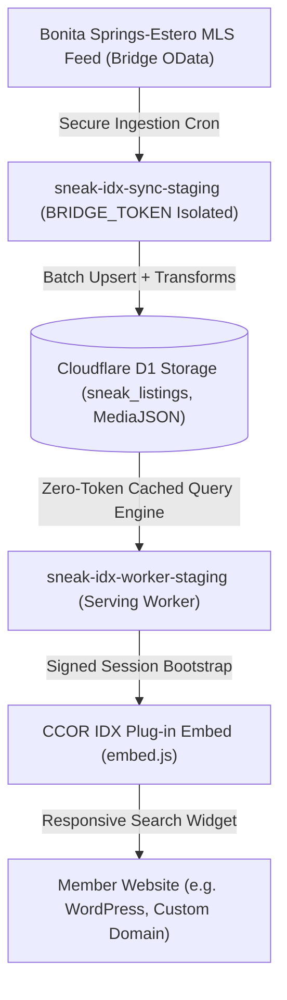

# CCOR IDX Plug-in: Competitor Parity & Feature Roadmap

This document outlines the product architecture, feed capability matrix, and strategic feature roadmap for the **CCOR IDX Plug-in** (formerly SNEAK IDX Platform) operated by the Bonita Springs-Estero REALTORS® (CCOR).

---

## 1. Executive Product Architecture

---

## 2. Feature Roadmap by Phase

### Phase 7.3A — Search Parity Foundation (CURRENT)
* **Goal:** Deliver consumer-grade search filtering across residential, commercial, and land properties with full mobile responsiveness and deterministic build telemetry.
* **Status:** `IN DEVELOPMENT / ACTIVE`
* **Features Included:**
  * Responsive 4-category navigation (`For Sale`, `Rental`, `Commercial`, `Lot & Land`).
  * Discrete dual-handle price range slider (`$0 — $20M+`).
  * Context-aware filter controls (automatic suppression of beds/baths/residential subtypes for commercial and land).
  * Comprehensive **More Filters** drawer (20+ consumer-facing filters).
  * **Wave-1 Advanced Filters:**
    * Waterfront (`WaterfrontYN = 1`)
    * Private Pool (`PoolPrivateYN = 1`)
    * Garage Spaces (`GarageSpaces >= N`)
    * New Construction (`NewConstructionYN = 1`)
    * Living Area Sq Ft min/max (`LivingArea`)
    * Lot Size Acres min/max (`LotSizeAcres`)
    * Year Built min/max (`YearBuilt`)
    * County, Postal Code (ZIP), Subdivision Name
    * Listing Activity (Open House Only, New in 7 Days, Price Reduced)
  * Multi-photo gallery served directly from D1 `MediaJSON` cache.
  * Site-owner lead capture routing with complete MLS broker attribution separation.
  * Deterministic UI build identification (`data-ui-build="2026.08.25.7.3a"`).

---

### Phase 7.3B — Interactive Map Search (PLANNED)
* **Goal:** Provide modern spatial property discovery with interactive polygons, radius search, and live viewport bounding.
* **Status:** `FUTURE`
* **Feature Candidates:**
  * **Search As I Move Map:** Debounced viewport bounding box search (`minLat, maxLat, minLng, maxLng`).
  * **Draw Polygon:** Freehand polygon and boundary drawing with turf.js spatial polygon inclusion.
  * **Radius Search:** Center-point distance radius filtering (`radiusMiles, centerLat, centerLng`).
  * **Near Me / Current Location:** HTML5 Geolocation device location centering.
  * **Map / List View Toggle:** Responsive full-map vs. full-list toggle on mobile viewports.
  * **Hide Map:** Consumer preference toggle to view grid only.

---

### Phase 7.3C — Buyer Retention & Client Tools (PLANNED)
* **Goal:** Provide consumer login, saved searches, automated email alerts, and lead CRM intelligence for participating REALTORS®.
* **Status:** `FUTURE`
* **Feature Candidates:**
  * **Consumer Accounts & Passwordless Auth:** Magic link login for property buyers on member websites.
  * **Saved Searches & Instant Email Alerts:** Automated daily/instant MLS alert emails matching saved search criteria.
  * **Server-Side Favorites:** Cloud-synced saved properties across mobile and desktop devices.
  * **Property Comparison Tool:** Side-by-side spec comparison of up to 4 listings.
  * **Recently Viewed Listings:** Persistent client-side and server-side history.
  * **Share Listing / Social Share:** Native Web Share API + shortlinks.
  * **Agent Lead Activity Dashboard:** Live timeline of client views, saved homes, and inquiries in Member Portal.

---

### Phase 7.3D — SEO & Market Content Engine (PLANNED)
* **Goal:** Drive organic Google search traffic and local community authority through static/edge-rendered SEO landing pages.
* **Status:** `FUTURE`
* **Feature Candidates:**
  * **SEO-Friendly Listing URLs:** Slugged paths (e.g. `/homes/bonita-springs/pelican-landing/3694-pleasant-springs-dr-224017488`).
  * **Community & Neighborhood Landing Pages:** Pre-filtered landing pages for major subdivisions (Pelican Landing, Bonita Bay, Miromar Lakes, Mediterra).
  * **Open House Landing Pages:** Weekend Open House directory with automated Friday updates.
  * **Dynamic XML Sitemaps:** Automated sitemap index generation containing all active MLS listing URLs.
  * **Local Market Statistics Widget:** Median price, days on market, and inventory trends for local communities.

---

## 3. BSAOR MLS Feed Capability & Feature Status Matrix

| Feature / Field Concept | RESO / BSAOR Standard Field | Data Type | Feed Coverage | Feature Status | Notes / Plan |
| :--- | :--- | :--- | :--- | :--- | :--- |
| **Property Categories** | `PropertyType` | `Edm.String` | 100.0% | `AVAILABLE` | Residential, Land, Lease, Commercial Sale |
| **Residential Subtypes** | `PropertySubType` | `Edm.String` | 36.2% | `AVAILABLE` | Single Family, Condo, Townhouse, Villa, Duplex |
| **Price Filter & Range** | `ListPrice` | `Edm.Double` | 100.0% | `AVAILABLE` | Dual-handle discrete price ladder slider |
| **Beds / Baths** | `BedroomsTotal`, `BathroomsTotalInteger` | `Edm.Int64` | 99.2% | `AVAILABLE` | Filter & card display (hidden on Land/Comm) |
| **Living Area / Sq Ft** | `LivingArea` | `Edm.Double` | 98.4% | `AVAILABLE` | Min/Max filter & sorting (`sqftDesc`) |
| **Lot Size / Acres** | `LotSizeAcres` | `Edm.Double` | 99.1% | `AVAILABLE` | Min/Max filter & sorting (`acresDesc`) |
| **Year Built** | `YearBuilt` | `Edm.Int64` | 97.6% | `AVAILABLE` | Min/Max filter & sorting (`yearDesc`) |
| **Waterfront** | `WaterfrontYN`, `WaterfrontFeatures` | `Edm.Boolean` | 31.3% / 99.8% | `AVAILABLE` | Wave-1 filter (`WaterfrontYN = 1`) |
| **Private Pool** | `PoolPrivateYN`, `PoolFeatures` | `Edm.Boolean` | 8.3% / 9.2% | `AVAILABLE` | Wave-1 filter (`PoolPrivateYN = 1`) |
| **Garage Spaces** | `GarageSpaces`, `AttachedGarageYN` | `Edm.Double` | 25.7% | `AVAILABLE` | Wave-1 filter (`GarageSpaces >= N`) |
| **New Construction** | `NewConstructionYN` | `Edm.Boolean` | 10.7% | `AVAILABLE` | Wave-1 filter (`NewConstructionYN = 1`) |
| **Open Houses** | `sneak_open_houses` (Bridge OpenHouse) | Table Join | Active Only | `AVAILABLE` | Filter (`openHouse=1`) & badge |
| **Price Reduced** | `OriginalListPrice`, `ListPrice` | `Edm.Double` | 96.0% | `AVAILABLE` | Filter (`ListPrice < OriginalListPrice`) |
| **New Listings (7 Days)** | `ListingContractDate` | `Edm.Date` | 100.0% | `AVAILABLE` | Filter (`newListingDays=7`) & Carousel |
| **Subdivision / Neighborhood** | `SubdivisionName` | `Edm.String` | 88.5% | `AVAILABLE` | Text search & filter matching |
| **County / Postal Code** | `CountyOrParish`, `PostalCode` | `Edm.String` | 100.0% | `AVAILABLE` | Dropdown & ZIP filter |
| **Zoning** | `Zoning` | `Edm.String` | 55.5% | `AVAILABLE` | Filter & card display for Commercial & Land |
| **Photo Gallery** | `MediaJSON` (Bridge Media array) | `Edm.String` | 99.4% | `AVAILABLE` | Full multi-photo carousel & thumbnails |
| **Interactive Map** | `Coordinates` / `Latitude`, `Longitude` | `REAL` | 99.1% | `AVAILABLE` | Clustered Leaflet markers with popups |
| **Spatial Polygon Search** | N/A (Client-Side Bounding Box) | `GeoJSON` | N/A | `FUTURE` | Planned for Phase 7.3B |
| **Radius Distance Search** | `Coordinates` Haversine SQL | Math | N/A | `FUTURE` | Planned for Phase 7.3B |
| **View Type (Canal/Golf/Water)** | `ViewYN`, `View` | `Collection` | 49.0% / 95.7% | `FEED AUDIT REQUIRED` | Planned for Wave-2 Amenity Filters |
| **55+ / Senior Community** | `SeniorCommunityYN` | `Edm.Boolean` | 0.2% | `NOT RECOMMENDED` | Unreliable feed coverage (< 1%) |
| **Virtual Tour Link** | `VirtualTourURLUnbranded` | `Edm.String` | 6.2% | `FUTURE` | Planned for Property Detail modal |
| **Furnished Status** | `Furnished` | `Edm.String` | 35.3% | `FUTURE` | Turnkey / Furnished / Unfurnished for Rentals |
| **Pets Policy** | `PetsAllowed` | `Collection` | 36.2% | `FUTURE` | Pets allowed filters for Rentals / Condos |
| **HOA Fee Amount** | `AssociationFee`, `AssociationFeeFrequency` | `Edm.Double` | 3.7% | `FEED AUDIT REQUIRED` | Low standard field coverage; check custom fields |
| **School District** | `ElementarySchool`, `HighSchool` | `Edm.String` | 15.2% | `FEED AUDIT REQUIRED` | Low coverage; check Lee/Collier mapping |
