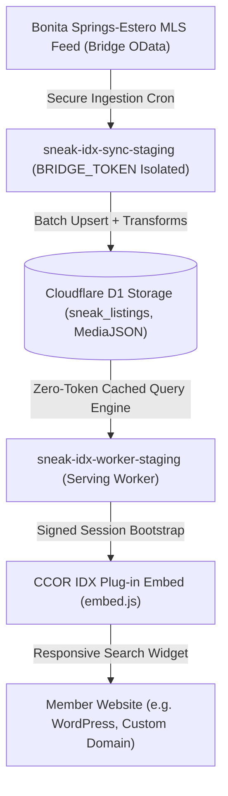

# CCOR IDX Plug-in: Competitor Parity & Feature Roadmap

This document outlines the product architecture, feed capability matrix, and strategic feature roadmap for the **CCOR IDX Plug-in** (formerly SNEAK IDX Platform) operated by the Bonita Springs-Estero REALTORS® (CCOR).

---

## 1. Executive Product Architecture

---

## 2. Feature Roadmap by Phase

### Phase 7.3A — Search Parity Foundation
* **Goal:** Deliver consumer-grade search filtering across residential, commercial, and land properties with full mobile responsiveness and deterministic build telemetry.
* **Status:** `COMPLETE`
* **Features Included:**
  * Responsive 4-category navigation (`For Sale`, `Rental`, `Commercial`, `Lot & Land`).
  * Discrete dual-handle price range slider (`$0 — $20M+`).
  * Context-aware filter controls (automatic suppression of beds/baths/residential subtypes for commercial and land).
  * Comprehensive **More Filters** drawer (20+ consumer-facing filters).
  * **Wave-1 Advanced Filters:** Waterfront, Pool, Garage, New Construction, Sqft, Acres, Year Built, County, ZIP, Subdivision, Activity.
  * Multi-photo gallery served directly from D1 `MediaJSON` cache.
  * Site-owner lead capture routing with complete MLS broker attribution separation.
  * Deterministic UI build identification (`2026.08.25.7.3a`).

---

### Phase 7.3B1 — Interactive Map/List Synchronization & Mobile Map UX (CURRENT)
* **Goal:** Deliver a unified, debounced viewport-synchronized map/list search experience with context-aware popups, card/marker cross-highlighting, and responsive tablet/mobile segmented toggle.
* **Status:** `COMPLETE / DEPLOYED`
* **Features Included:**
  * **Search As I Move Map:** 400ms debounced viewport bounding box search (`north, south, east, west`) applied simultaneously across `/idx/v1/search` and `/idx/v1/map`.
  * **Map Search Loop Prevention:** Map auto-fits initial results once on page load; user-initiated pan/zoom searches strictly maintain user viewport without resetting or jumping.
  * **Search As I Move Control:** Unobtrusive `Search as I move` checkbox overlay with dynamic `Search this area` button when toggle is unchecked.
  * **Context-Aware Map Popups:**
    * *Residential & Rental:* Price, address, `X bd • Y ba • Z sqft`, photo preview, View Details CTA. Zero fake `0 bd • 0 ba`.
    * *Lot & Land:* Price, address, `X Acres • Subdivision/City`, photo preview, View Details CTA (beds/baths suppressed).
    * *Commercial:* Price, address, `X sqft • Y Acres • Subtype • Zoning`, photo preview, View Details CTA (beds/baths suppressed).
  * **Bidirectional Map ↔ Card Synchronization:**
    * Hovering/focusing a listing card raises and glows the corresponding map marker pin (`pin-highlighted`).
    * Clicking a map marker pin highlights the listing card and smoothly scrolls it into view on desktop.
  * **Mobile / Tablet Segmented View Toggle (<= 1024px):** Replaced vertical stacking with `List | Map` segmented control (defaults to List mode with active listing count; Map mode automatically resizes Leaflet tiles via `map.invalidateSize()`).
  * **Race-Safe Fetching & Lightweight Loaders:** `AbortController` request cancellation prevents stale query overwrites; non-blocking spinner/overlay keeps the map draggable during movement.
  * **Truncation Indicator:** Map query selects `limit + 1` to gracefully flag and display `Too many properties to display. Zoom in to see more.`
  * **Deterministic UI Build:** `2026.08.27.7.3b1` telemetry verified across search app, embed loader, and console.

---

### Phase 7.3B2A — Radius Search, Near Me, Spatial State & Desktop Hide Map
* **Goal:** Deliver centralized frontend spatial search state, server-side equirectangular distance filtering in D1 SQLite, responsive Leaflet radius visualization, Near Me geolocation, and desktop map toggle.
* **Status:** `COMPLETE / DEPLOYED`
* **Features Included:**
  * **Centralized Spatial State Engine:** Mode precedence (`viewport` vs `radius`), center point coordinates, distance radius in miles, `isNearMe` origin tracking, search state serialization (`serializeSearchState` / `applySearchState` for Phase 7.3C preparation).
  * **D1 SQL Equirectangular Distance Filtering:** Bounding box prefilter + parameterized distance math executed server-side across `/idx/v1/search` and `/idx/v1/map`.
  * **Radius Map UI & Visualization:** Quick distance selector chips (1, 2, 5, 10, 25 mi), interactive map center placement, dynamic Leaflet circle rendering, fit-to-radius bounds once.
  * **Near Me Geolocation:** Compact GPS location search with HTML5 `navigator.geolocation`, fallback friendly messaging, ephemeral coordinates without telemetry storage.
  * **Desktop Hide Map (> 1024px):** Toggle button collapses map and expands listings grid to 100% full width; persisted in `localStorage` (`ccor_idx_map_visible_${SITE_KEY}`).
  * **Active Spatial Badges:** Responsive `Within X mi ✕` pill in secondary filter toolbar and on-map badge overlay with one-click area clearing.
  * **Deterministic UI Build:** `2026.08.27.7.3b2a` across search UI, embed loader, and tests.

---

### Phase 7.3B2B — Draw Area / Server-Authoritative Polygon Search (CURRENT)
* **Goal:** Deliver custom interactive polygon search area drawing, draggable vertex editing, hardened spatial validation with HTTP 400 rejection on malformed spatial parameters, and server-authoritative ray-casting point-in-polygon SQL execution in Cloudflare D1 SQLite.
* **Status:** `COMPLETE / DEPLOYED`
* **Features Included:**
  * **Custom Draw Area Tool & UI:** Interactive map drawing with crosshair cursor, dynamic dashed guide lines, vertex placement with auto-close snapping to start vertex, floating control banner with one-click Complete / Cancel.
  * **Draggable Vertex Editing:** One-click `Edit Area` turns polygon vertices into draggable handles with live geometry updates, saving to state on completion without premature intermediate queries.
  * **Server-Authoritative D1 SQL Ray-Casting:** Bounding box prefilter (`Latitude BETWEEN ? AND ? AND Longitude BETWEEN ? AND ?`) + parameterized ray-crossing SQLite modulo expression (`((edge1 + ... + edgeN) % 2) = 1`). Exact search counts, pagination totals, and map markers agree 100%.
  * **Hardened Spatial Validation:** Explicit HTTP 400 `InvalidSpatialFilter` returned on incomplete radius parameters or malformed GeoJSON geometry; prevents silent search broadening.
  * **GeoJSON Polygon Serialization:** 5-6 decimal place normalized coordinate storage in `spatialState.polygon`, fully serializable and restorable via `serializeSearchState()` / `applySearchState()`.
  * **Mutual Exclusivity & Clean Mode Switching:** Drawing a polygon automatically clears radius; selecting radius clears polygon; clearing area returns to standard viewport mode.
  * **Deterministic UI Build:** `2026.08.27.7.3b2b` across search UI, embed loader, and verification scripts.

---

### Phase 7.3C1A — Buyer Identity, Passwordless Authentication & Server Favorites (COMPLETED)
* **Goal:** Deliver site-scoped consumer identity, passwordless magic-link authentication with 2-minute exchange codes, 14-day revocable sessions, server favorites with anonymous union merge, address suppression compliance, and XSS sanitization.
* **Status:** `COMPLETE / DEPLOYED`
* **Features Included:**
  * **Isolated Consumer Worker & Trust Realm (`sneak-consumer/`):** Dedicated worker (`sneak-idx-consumer-staging`) strictly isolated from member/admin realms (`sneak-member/`).
  * **Site-Scoped Consumer Identity:** `sneak_consumer_users` with `UNIQUE(site_id, email)` ensures buyer accounts on Agent A vs Agent B sites are isolated tenants.
  * **Passwordless Magic Links & Rate Limiting:** Single-use SHA-256 hashed magic links with 15-minute TTL; generic anti-enumeration responses protect user privacy; IP & email rate limiting defense.
  * **Open-Redirect & Protocol Protection:** Return URLs strictly verified against active verified hostnames in `sneak_domains` with mandatory HTTPS.
  * **2-Minute Exchange Code Handoff:** Atomic single-use exchange code in `sneak_consumer_auth_exchanges` prevents exposure of long-lived session tokens in redirect URLs.
  * **Embed Parent Handoff:** `embed.js` extracts `auth_code` from parent page query, forwards into search iframe, and cleans parent browser URL with `history.replaceState`.
  * **Server Favorites & Local Anonymous Merge:** `sneak_consumer_favorites` (max 200 items); optimistic heart icon toggles; POST `/api/consumer/favorites/merge` automatically merges anonymous local favorites on sign-in.
  * **XSS Sanitization & MLS Security:** `escapeHtml` and `sanitizeUrl` guard all dynamic HTML rendering across listing cards, popups, and carousels.
  * **Deterministic UI Build:** `2026.08.27.7.3c1a` across search UI, embed loader, consumer worker, and test suites.

### Phase 7.3C1B — Embed Layout Stabilization & Saved Searches / State Restore (COMPLETED)
* **Goal:** Stabilize the embedded search layout into a true app shell, eliminate host website bottom cut-offs, provide responsive parent iframe height scaling, and deliver server-persisted saved searches with duplicate detection and round-trip state restoration.
* **Status:** `COMPLETE / DEPLOYED`
* **Features Included:**
  * **Embed App-Shell Architecture:** Refactored embedded search (`body.is-embedded`) to a CSS flex container (`flex-direction: column; height: 100vh; overflow: hidden;`), consuming all remaining iframe height for map and listings without pushing content beyond iframe boundary into host website footers.
  * **Parent Iframe Height Stabilization:** Responsive desktop default `clamp(780px, 85vh, 960px)` in `embed.js`, respecting optional `data-height` and `data-fixed-height` attributes.
  * **Secured PostMessage Resize Channel:** Window source validation (`e.source === iframe.contentWindow`), site key match, height bounds enforcement (400px–3000px), and anti-jitter debouncing (<= 3px filter).
  * **Saved Searches Schema (`sneak_consumer_saved_searches`):** Cloudflare D1 table with foreign key isolation to `sneak_sites(id)` and `sneak_consumer_users(id)`, compound indexes for rapid user listing and duplicate detection.
  * **Search State Normalization & Privacy:** Strict validation engine (max 16KB, version 1); converts dynamic GPS Near Me tracking to static coordinate radius centers; validates max 40 polygon vertices.
  * **Duplicate Detection via SHA-256 (`state_hash`):** Matching search criteria automatically updates search name and timestamp instead of creating duplicate records; enforced 25 saved searches limit per consumer/site.
  * **Consumer Saved Searches API:** Full REST CRUD endpoints (`GET`, `POST`, `PATCH /:id`, `DELETE /:id`) under `/api/consumer/saved-searches` with tenant isolation.
  * **UI Integration & Search Restore:** Save Search trigger button in toolbar, modal naming dialog with criteria summary, Saved Searches list modal with View/Rename/Delete, and pending anonymous save intent restoration across magic-link sign-in.
  * **Deterministic UI Build:** `2026.08.28.7.3c1b` across search UI, embed loader, consumer worker, and test suites.

#### 7.3C1B.1 Layout Hotfix (COMPLETED)
* **Exact Regression:** Live WordPress pilot on `/idx-test/` rendered with crushed Map/List workspace, clipped listings, and footer placement anomalies.
* **Root Cause:**
  1. *Stale `data-height="850px"` in WordPress snippet:* Overrode modern responsive height because `embed.js` lacked parent window resize listeners and treated legacy `data-height` as an immutable fixed height rather than a compatibility hint.
  2. *Footer disclaimer consuming app flex space:* `.footer-disclaimer` was placed outside `.main-container` directly under `body`, consuming ~180px of flexbox height inside `body.is-embedded` (which was constrained to 100vh).
  3. *Unclosed CSS media query syntax error:* Unclosed selector and media query around line 1979 prevented modal and responsive rules from applying properly on desktop.
  4. *Mobile listings height collapse:* `.main-container.mobile-list-view .listings-section` used `height: auto !important` instead of bounded internal scrolling.
* **Final Embed Sizing Model:**
  * **Deterministic Parent-Controlled Responsive Sizing:** `getRecommendedSearchHeight()` dynamically calculates optimal height based on parent viewport:
    * Desktop (`> 1024px`): `Math.max(860, Math.min(Math.round(viewportHeight * 0.90), 1050))` (~860px–960px).
    * Tablet (`601px - 1024px`): `Math.max(760, Math.min(Math.round(viewportHeight * 0.88), 920))` (~760px).
    * Mobile (`<= 600px`): `Math.max(680, Math.min(Math.round(viewportHeight * 0.88), 850))` (~680px–740px).
  * **Debounced Parent Window Resize:** Window resize listener (150ms debounce) recalculates iframe height continuously across orientation changes and desktop resizing (bypassed only when `data-fixed-height="true"` is explicitly set).
  * **Nested Disclaimer Stream:** Moved `.footer-disclaimer` inside `.listings-section` beneath `#paginationBar`, freeing 180px of permanent vertical space for a 620px+ usable Map/List workspace.
  * **Compact Carousel & Syntax Fix:** Refined carousel image height to 100px and repaired all CSS media query blocks.
* **Tested Viewports:** Desktop (1440×900, 1920×1080), Tablet (1024×768), Mobile (390×844).
* **Deterministic UI Build:** `2026.08.28.7.3c1b1`.

---

### Phase 7.3C2A — Saved Search Email Alert Engine & Delivery Infrastructure (COMPLETED)
* **Goal:** Deliver scheduled automated email alerts (ASAP and Daily digest) matching saved search criteria with exact query parity, anti-spam baseline isolation, delivery idempotency, context-aware specs, address suppression, deep linking, and one-click tamper-proof unsubscribe.
* **Status:** `COMPLETE / DEPLOYED`
* **Features Included:**
  * **Dedicated Alert Worker (`sneak-alerts/`):** Cloudflare Worker (`sneak-idx-alerts-staging`) running scheduled cron jobs (`10,25,40,55 * * * *`) offset from MLS sync to prevent race conditions.
  * **Strict Security Boundary:** Zero Bridge token, zero GrowthZone credentials, zero Stripe secrets. Queries inventory directly from Cloudflare D1.
  * **Shared Query Parity Engine (`sneak-shared/idx-query.js`):** Unified `buildSavedSearchWhereQuery` ensures 100% criteria agreement between public search and alert matching across residential, rental, land, commercial, radius, and polygon modes.
  * **Baseline Anti-Spam Guarantee:** Alert activation sets `enabled_at = now`; historical inventory matching the search before enablement is strictly excluded to prevent inbox flooding.
  * **Idempotent Match Ledger (`sneak_consumer_alert_matches`):** `UNIQUE(alert_id, listing_key, event_type)` ensures each new property is alerted at most once per saved search.
  * **Daily Digest Scheduling:** Timezone-aware date calculations (`getLocalTimeInZone`) send daily digests at/after 8:00 AM local time, strictly once per local calendar day (`last_daily_local_date`).
  * **Context-Aware Email Cards & Attribution:** Up to 10 property cards per email with beds/baths/sqft for residential/rental, acres/subdivision for land, sqft/acres/subtype/zoning for commercial, mandatory listing brokerage attribution, and `InternetAddressDisplayYN` address suppression.
  * **Deep Linking (`?ccor_listing=<ListingKey>`):** Embed loader and search app parse listing key, validate tenant session/scope, and open property detail modal with graceful fallback notice if unavailable.
  * **One-Click Signed Unsubscribe:** Tamper-proof HMAC-SHA256 tokens disable alerts without requiring user login or passwords.
  * **Delivery Logging & Bounded Retries:** `sneak_consumer_alert_deliveries` tracks provider message IDs, delivery statuses (`sent`, `failed`, `provider_unconfigured`), and error codes.
  * **Deterministic UI Build:** `2026.08.28.7.3c2a` across alert worker, consumer worker, serving worker, embed loader, and test suites.

#### 7.3C2A.1 Alert Delivery Correctness, Concurrency & Secret Hardening Hotfix (COMPLETED)
* **Goal:** Enforce fail-closed secret handling, eliminate all hardcoded fallback signing secrets, make alert delivery concurrency-safe via atomic claim-before-send semantics, and fix delivery status accounting so `provider_unconfigured` never marks listings as permanently notified.
* **Status:** `COMPLETE / DEPLOYED`
* **Features & Correctness Hardening:**
  * **HOTFIX 1 — provider_unconfigured Semantics:** When Mailjet credentials are absent or unconfigured in staging/dev, transactional email provider returns `{ success: false, retryable: true, status: 'provider_unconfigured' }`. Worker records delivery row with `status = 'provider_unconfigured'` and `sent_at = NULL`, leaves candidate listings retryable without setting `notified_at` or advancing `last_sent_at`, and tallies `emailsDeferred += 1` (`emailsSent = 0`).
  * **HOTFIX 2 — Removal of Fallback Signing Secrets:** Completely removed `'sneak-default-token-secret-fallback-key'` from all runtime code. Tokens require `SNEAK_ALERT_UNSUBSCRIBE_SECRET` or `SNEAK_SIGNING_SECRET` (>= 16 chars). Worker fails closed with delivery deferral and returns HTTP 503 on unsubscribe route when secrets are missing.
  * **HOTFIX 3 — Atomic Claim-Before-Send Idempotency:** Implemented atomic listing claiming in `sneak_consumer_alert_matches` with `claim_id`, `claimed_at`, `claim_expires_at` (10 mins), and `delivery_status = 'claimed'`. Only candidate listings claimed by the current execution run are included in alert delivery. Concurrent executions competing for the same listings produce exactly 1 delivered email with zero duplicate sends.
  * **D1 Migration 0029:** Added `claim_id`, `claimed_at`, `claim_expires_at`, `delivery_status`, `attempt_count` columns and index `idx_sneak_consumer_alert_matches_claim` to `sneak_consumer_alert_matches`, plus `emails_deferred` to `sneak_alert_runs`.
  * **Deterministic UI & Worker Build:** `2026.08.30.7.3c2a1` across alert worker, consumer worker, embed loader, search UI, and test suites.

---

### Phase 7.3C2B — Agent Client Activity Dashboard (NEXT)
* **Goal:** Live timeline of client views, saved properties, saved searches, and inquiries in REALTOR® Member Portal.
* **Status:** `PLANNED`

---

### Phase 7.3C3 — Property Comparison, Recently Viewed & Sharing (PLANNED)
* **Goal:** Side-by-side listing comparison (up to 4 homes), recently viewed history, and social/native sharing.
* **Status:** `PLANNED`

---

### Phase 7.3D — SEO & Market Content Engine (PLANNED)
* **Goal:** Drive organic Google search traffic and local community authority through static/edge-rendered SEO landing pages.
* **Status:** `FUTURE`
* **Feature Candidates:**
  * **SEO-Friendly Listing URLs:** Slugged paths (e.g. `/homes/bonita-springs/pelican-landing/3694-pleasant-springs-dr-224017488`).
  * **Community & Neighborhood Landing Pages:** Pre-filtered landing pages for major subdivisions (Pelican Landing, Bonita Bay, Miromar Lakes, Mediterra).
  * **Open House Landing Pages:** Weekend Open House directory with automated Friday updates.
  * **Dynamic XML Sitemaps:** Automated sitemap index generation containing all active MLS listing URLs.
  * **Local Market Statistics Widget:** Median price, days on market, and inventory trends for local communities.

---

## 3. BSAOR MLS Feed Capability & Feature Status Matrix

| Feature / Field Concept | RESO / BSAOR Standard Field | Data Type | Feed Coverage | Feature Status | Notes / Plan |
| :--- | :--- | :--- | :--- | :--- | :--- |
| **Property Categories** | `PropertyType` | `Edm.String` | 100.0% | `AVAILABLE` | Residential, Land, Lease, Commercial Sale |
| **Residential Subtypes** | `PropertySubType` | `Edm.String` | 36.2% | `AVAILABLE` | Single Family, Condo, Townhouse, Villa, Duplex |
| **Price Filter & Range** | `ListPrice` | `Edm.Double` | 100.0% | `AVAILABLE` | Dual-handle discrete price ladder slider |
| **Beds / Baths** | `BedroomsTotal`, `BathroomsTotalInteger` | `Edm.Int64` | 99.2% | `AVAILABLE` | Filter & card display (hidden on Land/Comm) |
| **Living Area / Sq Ft** | `LivingArea` | `Edm.Double` | 98.4% | `AVAILABLE` | Min/Max filter & sorting (`sqftDesc`) |
| **Lot Size / Acres** | `LotSizeAcres` | `Edm.Double` | 99.1% | `AVAILABLE` | Min/Max filter & sorting (`acresDesc`) |
| **Year Built** | `YearBuilt` | `Edm.Int64` | 97.6% | `AVAILABLE` | Min/Max filter & sorting (`yearDesc`) |
| **Waterfront** | `WaterfrontYN`, `WaterfrontFeatures` | `Edm.Boolean` | 31.3% / 99.8% | `AVAILABLE` | Wave-1 filter (`WaterfrontYN = 1`) |
| **Private Pool** | `PoolPrivateYN`, `PoolFeatures` | `Edm.Boolean` | 8.3% / 9.2% | `AVAILABLE` | Wave-1 filter (`PoolPrivateYN = 1`) |
| **Garage Spaces** | `GarageSpaces`, `AttachedGarageYN` | `Edm.Double` | 25.7% | `AVAILABLE` | Wave-1 filter (`GarageSpaces >= N`) |
| **New Construction** | `NewConstructionYN` | `Edm.Boolean` | 10.7% | `AVAILABLE` | Wave-1 filter (`NewConstructionYN = 1`) |
| **Open Houses** | `sneak_open_houses` (Bridge OpenHouse) | Table Join | Active Only | `AVAILABLE` | Filter (`openHouse=1`) & badge |
| **Price Reduced** | `OriginalListPrice`, `ListPrice` | `Edm.Double` | 96.0% | `AVAILABLE` | Filter (`ListPrice < OriginalListPrice`) |
| **New Listings (7 Days)** | `ListingContractDate` | `Edm.Date` | 100.0% | `AVAILABLE` | Filter (`newListingDays=7`) & Carousel |
| **Subdivision / Neighborhood** | `SubdivisionName` | `Edm.String` | 88.5% | `AVAILABLE` | Text search & filter matching |
| **County / Postal Code** | `CountyOrParish`, `PostalCode` | `Edm.String` | 100.0% | `AVAILABLE` | Dropdown & ZIP filter |
| **Zoning** | `Zoning` | `Edm.String` | 55.5% | `AVAILABLE` | Filter & card display for Commercial & Land |
| **Photo Gallery** | `MediaJSON` (Bridge Media array) | `Edm.String` | 99.4% | `AVAILABLE` | Full multi-photo carousel & thumbnails |
| **Interactive Map** | `Coordinates` / `Latitude`, `Longitude` | `REAL` | 99.1% | `AVAILABLE` | Clustered Leaflet markers with popups |
| **Spatial Polygon Search** | `Coordinates` Ray-Casting SQLite SQL | `GeoJSON` | 99.1% | `AVAILABLE` | Server-authoritative ray-casting polygon filter (Phase 7.3B2B) |
| **Radius Distance Search** | `Coordinates` Equirectangular D1 SQL | Math | 99.1% | `AVAILABLE` | Server-authoritative distance radius filter (Phase 7.3B2A) |
| **View Type (Canal/Golf/Water)** | `ViewYN`, `View` | `Collection` | 49.0% / 95.7% | `FEED AUDIT REQUIRED` | Planned for Wave-2 Amenity Filters |
| **55+ / Senior Community** | `SeniorCommunityYN` | `Edm.Boolean` | 0.2% | `NOT RECOMMENDED` | Unreliable feed coverage (< 1%) |
| **Virtual Tour Link** | `VirtualTourURLUnbranded` | `Edm.String` | 6.2% | `FUTURE` | Planned for Property Detail modal |
| **Furnished Status** | `Furnished` | `Edm.String` | 35.3% | `FUTURE` | Turnkey / Furnished / Unfurnished for Rentals |
| **Pets Policy** | `PetsAllowed` | `Collection` | 36.2% | `FUTURE` | Pets allowed filters for Rentals / Condos |
| **HOA Fee Amount** | `AssociationFee`, `AssociationFeeFrequency` | `Edm.Double` | 3.7% | `FEED AUDIT REQUIRED` | Low standard field coverage; check custom fields |
| **School District** | `ElementarySchool`, `HighSchool` | `Edm.String` | 15.2% | `FEED AUDIT REQUIRED` | Low coverage; check Lee/Collier mapping |
